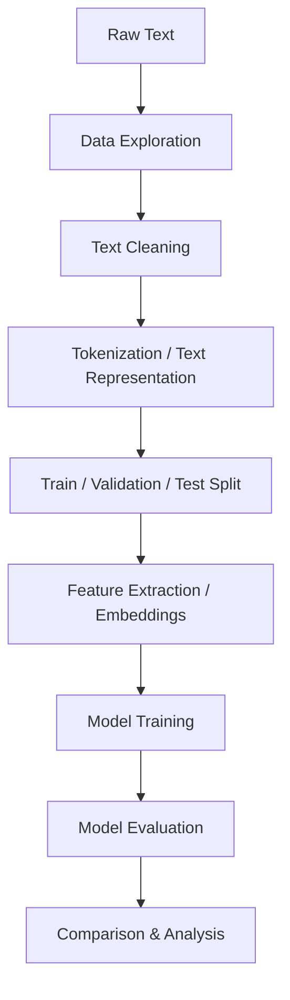

# imdb_sentiment-analysis
Comparative sentiment analysis using Machine Learning, ANN, LSTM, and Transformer-based NLP models.
<div align="center">

# 🎭 Sentiment Analysis
### Machine Learning & Deep Learning Comparison

*A comparative NLP project exploring sentiment classification across traditional ML, ANN, LSTM, and Transformer architectures.*


</div>

---

## 📖 Table of Contents

- [Project Overview](#-project-overview)
- [Objectives](#-objectives)
- [Project Structure](#️-project-structure)
- [NLP Pipeline](#-nlp-pipeline)
- [Dataset](#-dataset)
- [Text Preprocessing](#-text-preprocessing)
- [Machine Learning Approach](#-machine-learning-approach)
- [Deep Learning Approaches](#-deep-learning-approaches)
- [Model Comparison](#-model-comparison)
- [Key Finding: Overfitting](#️-important-finding-overfitting)
- [Evaluation](#-evaluation)
- [Key Concepts Demonstrated](#-key-concepts-demonstrated)
- [What I Learned](#-what-i-learned)
- [Technologies Used](#️-technologies-used)
- [Future Improvements](#-future-improvements)
- [Author](#-author)

---

## 📌 Project Overview

**Sentiment Analysis** is an NLP task used to determine the emotional polarity of a piece of text — commonly classified as:

<div align="center">

| 😊 Positive | 😠 Negative |
|:---:|:---:|

</div>

This project implements and compares multiple approaches to sentiment classification:

<table>
<tr>
<td width="50%" valign="top">

**🤖 Machine Learning**
- Logistic Regression
- TF-IDF feature pipeline

</td>
<td width="50%" valign="top">

**🧠 Deep Learning**
- Artificial Neural Network (ANN)
- Long Short-Term Memory (LSTM)
- Transformer-based model

</td>
</tr>
</table>

> The focus is on understanding the **strengths, limitations, and training behavior** of each approach — rather than relying on a single model.

---

## 🎯 Objectives

- ✅ Understand the complete NLP sentiment-analysis pipeline
- ✅ Clean and preprocess raw textual data
- ✅ Convert text into numerical representations
- ✅ Build traditional Machine Learning baselines
- ✅ Experiment with neural-network-based approaches
- ✅ Understand how LSTM handles sequential text data
- ✅ Explore Transformer-based NLP models
- ✅ Compare different architectures for sentiment classification
- ✅ Analyze model performance and identify overfitting
- ✅ Understand practical differences between traditional ML and modern deep learning

---

## 🗂️ Project Structure

```text
sentiment-analysis/
│
├── sentiment_analysis.ipynb    # Main implementation & experiments
├── README.md                   # Project documentation
└── dataset/                    # Data used for training/evaluation
    └── ...
```

---

## 🔄 NLP Pipeline

<div align="center">



</div>

---

## 📊 Dataset

The project uses a labeled sentiment dataset containing textual reviews/comments and their corresponding sentiment labels.

| Text | Label |
|------|:---:|
| "This movie was amazing!" | 🟢 Positive |
| "I really disliked this movie." | 🔴 Negative |

Class distribution was checked during exploration to identify potential imbalance between sentiment classes.

---

## 🧹 Text Preprocessing

Before training, the raw text was processed to make it suitable for NLP algorithms:

- 🔤 Converting text to a consistent format
- ✂️ Removing unnecessary characters
- 🧽 Cleaning unwanted text elements
- 🏷️ Preparing labels
- 🔍 Tokenizing text where required
- 🔢 Converting text into numerical representations

> 📓 Full implementation details are available in the accompanying notebook.

---

## 🤖 Machine Learning Approach

### TF-IDF

Textual data was transformed into numerical vectors using **TF-IDF (Term Frequency–Inverse Document Frequency)**, which represents how important a word is within a document relative to the full collection of documents.

```text
Text → TF-IDF → Numerical Feature Vectors → ML Model → Sentiment Prediction
```

### Logistic Regression

Logistic Regression served as the primary baseline model, learning a decision boundary between sentiment classes using the TF-IDF representation.

<div align="center">

### 🏆 Baseline Result

| Model | Accuracy |
|---|:---:|
| **TF-IDF + Logistic Regression** | **~88%** |

</div>

This provided a strong traditional ML baseline for comparison against the deep-learning approaches.

---

## 🧠 Deep Learning Approaches

### 1️⃣ Artificial Neural Network (ANN)

A basic neural architecture used to bridge traditional ML and deep learning.

```text
Text → Numerical Representation → Dense Layer → Activation → Dense Layer → Output → Sentiment
```

---

### 2️⃣ LSTM

Since text is sequential, **Long Short-Term Memory (LSTM)** networks were used to retain information from previous tokens via internal memory mechanisms.

```text
Text Sequence → Embedding → LSTM → Dense Layer → Classification → Positive / Negative
```

#### 📉 LSTM Training Analysis

<div align="center">

| Metric | Epoch 9 (Best) | Epoch 45 (Final) |
|---|:---:|:---:|
| Training Accuracy | — | **100%** |
| Validation Accuracy | **78.76%** | 68.74% |
| Validation Loss | — | 3.8222 |

</div>

This is a textbook case of **overfitting** — the model kept memorizing the training data while its ability to generalize steadily declined.

```text
Training Accuracy                    Validation Accuracy
      ↑                                    ↑
      │            ╱                       │       ╱╲
      │          ╱                         │      ╱  ╲
      │        ╱                           │     ╱    ╲
      │      ╱                             │    ╱      ╲
      │____╱_________ Epochs               │___╱________╲____ Epochs
```

> 💡 The best validation performance occurred far earlier than the final epoch — proof that training longer isn't always better.

---

### 3️⃣ Transformer

A Transformer-based model was explored to capture word relationships through **attention mechanisms**, rather than sequential recurrence like RNNs/LSTMs.

```text
Text → Tokenization → Embeddings → Transformer → Classification Layer → Sentiment
```

> ℹ️ BERT was intentionally excluded from this project's scope.

---

## 📈 Model Comparison

| Approach | Representation | Main Idea |
|---|---|---|
| **Logistic Regression** | TF-IDF | Traditional statistical classification |
| **ANN** | Numerical text representation | Feed-forward neural learning |
| **LSTM** | Sequential token representation | Contextual learning through recurrence |
| **Transformer** | Token/embedding representation | Relationship learning through attention |

The comparison was **educational and architectural** — understanding *how* each model processes text differently and how training behavior shifts as architectures grow more sophisticated.

---

## ⚠️ Important Finding: Overfitting

<div align="center">

```text
Training Accuracy         → 100%
Best Validation Accuracy  → 78.76%
Final Validation Accuracy → 68.74%
```

</div>

High training accuracy **does not** guarantee strong performance on unseen data. This experiment underscores the importance of:

- 🧪 Validation data
- ⏹️ Early stopping
- 🎛️ Regularization
- 📏 Model complexity management
- 📦 Dataset size
- ✂️ Proper train/validation/test splitting
- 📊 Monitoring validation loss & accuracy

---

## 🧪 Evaluation

Model performance was measured with standard classification metrics:

`Accuracy` · `Precision` · `Recall` · `F1-score` · `Confusion Matrix`

<div align="center">

|  | **Predicted Negative** | **Predicted Positive** |
|---|:---:|:---:|
| **Actual Negative** | TN | FP |
| **Actual Positive** | FN | TP |

</div>

These metrics give a far more complete picture of performance than accuracy alone.

---

## 🧠 Key Concepts Demonstrated

<table>
<tr>
<td valign="top" width="33%">

**📝 NLP**
- Text preprocessing
- Tokenization
- Text normalization
- Sentiment classification
- TF-IDF

</td>
<td valign="top" width="33%">

**🤖 Machine Learning**
- Feature extraction
- Logistic Regression
- Classification
- Model evaluation
- Confusion matrix
- Precision / Recall / F1

</td>
<td valign="top" width="33%">

**🧠 Deep Learning**
- Artificial Neural Networks
- Embeddings
- Sequential modeling
- LSTM
- Transformers
- Overfitting analysis

</td>
</tr>
</table>

---

## 🔬 What I Learned

```text
Traditional ML → TF-IDF + Logistic Regression → ANN → RNN / LSTM → Transformer → Modern NLP / LLMs
```

Each architecture solves the limitations of earlier approaches in its own way:

- **Traditional ML** (Logistic Regression) performs surprisingly well with strong feature engineering like TF-IDF
- **ANNs** introduce nonlinear learning
- **LSTMs** are purpose-built to model sequential dependencies
- **Transformers** use attention to capture token relationships without recurrence

---

## 🛠️ Technologies Used

<div align="center">


</div>

- Python
- Jupyter Notebook / Google Colab
- Pandas & NumPy
- Matplotlib
- Scikit-learn
- TensorFlow / Keras
- NLP techniques: TF-IDF, ANN, LSTM, Transformer architectures

---

## 🚀 Future Improvements

- [ ] Better handling of class imbalance
- [ ] More extensive hyperparameter tuning
- [ ] Early stopping for deep-learning models
- [ ] Dropout and regularization
- [ ] Larger and more diverse datasets
- [ ] Better text preprocessing
- [ ] More systematic model comparison
- [ ] Cross-validation for traditional ML models
- [ ] Detailed error analysis
- [ ] Fine-tuning modern pretrained Transformer models

---

## 📚 Project Purpose

This project was built as a practical learning exercise to understand **NLP, Machine Learning, and Deep Learning** for text classification — experimenting with multiple architectures rather than relying on one, to see how each represents and processes language differently.

> 💬 **"A model that performs extremely well on training data is not necessarily a model that generalizes well to unseen data."**

The LSTM experiment, in particular, offered a hands-on lesson in overfitting and the importance of validation-based model selection.

---

## 👨‍💻 Author

<div align="center">

### **Danish Farman**
*BS Software Engineering*

Interested in: `Artificial Intelligence` · `Machine Learning` · `Deep Learning` · `NLP` · `LLMs` · `AI Engineering`

</div>

---

<div align="center">

### ⭐ If you found this project useful, consider giving it a star!

Explore the notebook for the complete preprocessing pipeline, model implementations, training experiments, evaluation metrics, and comparisons.

</div>
